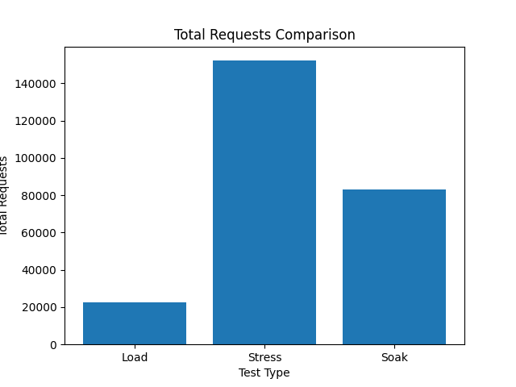
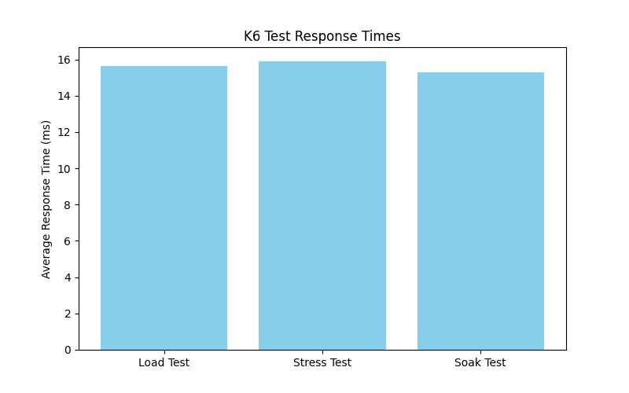
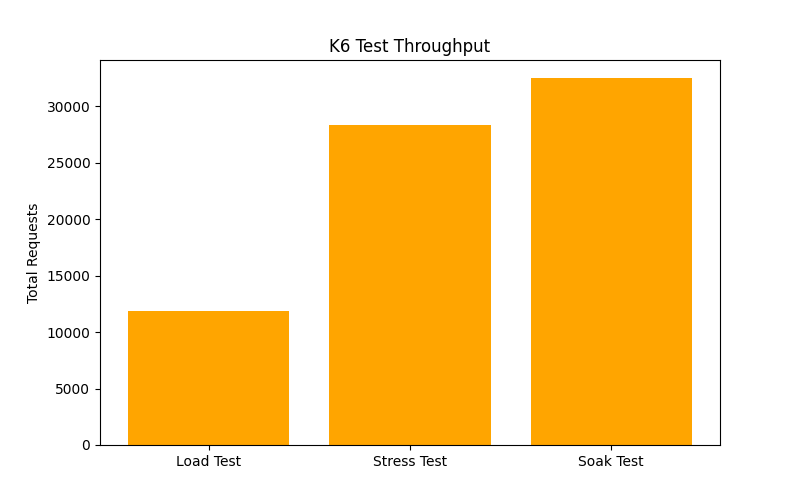
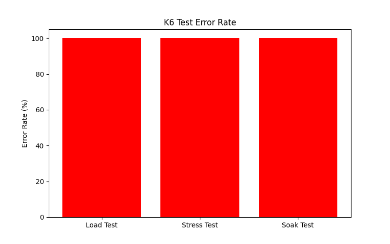

### Visual Analysis of Performance Results

The following charts summarise the overall performance behaviour of the application across the Load, Stress, and Soak tests.

#### Total Requests Comparison

This chart compares the total number of requests executed in each test type, showing how the Stress Test generated the highest volume of traffic, followed by the Soak Test and Load Test.

#### Average Response Time

This chart illustrates the response time trend for each test scenario, highlighting how the application behaves as the load and duration increase.

#### Throughput

This chart shows the throughput (requests per second) for the different test types, providing insight into how much traffic the system was able to handle.

#### Error Rate

This chart presents the error rate across the tests. A low or zero error rate indicates that the application remained stable and was able to handle the simulated traffic without failing.

